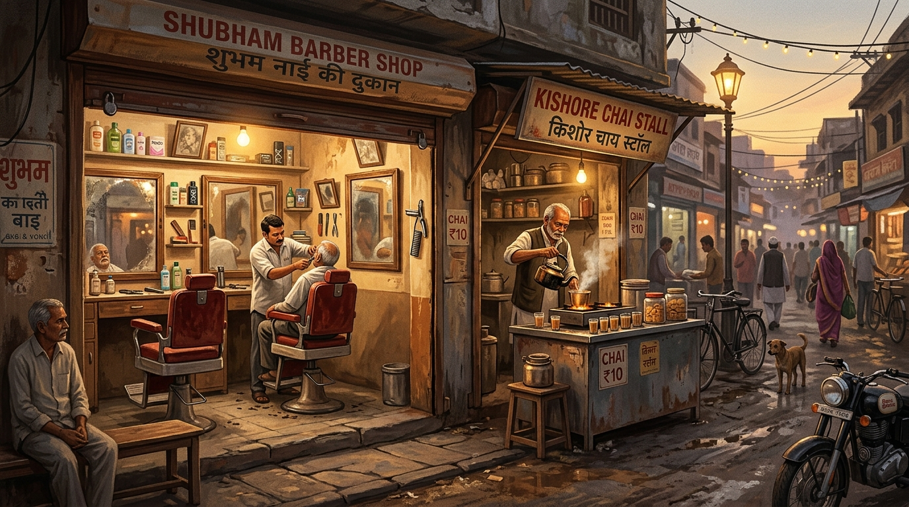

# 💈 Deluxe Salon Songs (डीलक्स सैलून सॉन्ग्स) — 90s Hindi Songs Radio

A nostalgic, live 90s Bollywood radio web application inspired by the immortal soundscape of Indian neighborhood barber shops, truck cabins, and highway dhabas.



---

## ✨ Features

- **3D Coverflow Song Changing Carousel**:
  - Center active track with glowing amber aura and elevated 3D depth.
  - Left and right flanking cards rotated in 3D perspective (`rotateY`).
  - Click any card to smoothly slide it to center and play.
  - Supports keyboard arrow navigation (`←` and `→`) and touch/mouse swipe.
- **Hidden YouTube Audio Engine**:
  - Streams 100% legally through YouTube's official IFrame Player API.
  - Zero audio hosting or bandwidth costs.
  - Automatic queueing & continuous radio playback (`onSongEnd` auto-advances).
- **Cinematic Atmospheric Barbershop Visuals**:
  - Nostalgic Indian street barbershop & chai stall artwork.
  - Realistic Canvas-based floating dust motes & gentle chai smog/smoke particles.
  - Retro Hindi 3D typography billboard: **डीलक्स सैलून**.
- **Top Navigation & Presence Counter**:
  - Live listener count pill (`🟢 1,022 Listening`) that naturally fluctuates.
  - Active playlist selector pill (e.g. `Laila Majnu 🌺`, `90s Salon Vibe 💈`).
- **Glassmorphic Bottom Player Dock**:
  - Play, Pause, Next, Previous controls.
  - Real-time scrubbable progress bar with timestamps (`2:15 / 4:23`).
  - Mini album art, song title, and artist display.
  - Repeat (`off`, `all`, `one`), Shuffle, and Volume slider.
  - One-click Fullscreen cinema mode (`⛶`).
- **Shareable URLs**:
  - Synchronizes URL query parameters (`?playlist=laila-majnu&song=cE4atl_v-Z0`) so users can share exact songs on WhatsApp and social media.

---

## 🚀 How to Run Locally

1. **Install Dependencies** (already done):
   ```bash
   npm install
   ```

2. **Start Development Server**:
   ```bash
   npm run dev
   ```
   Open your browser at [http://localhost:3000](http://localhost:3000).

3. **Build for Production**:
   ```bash
   npm run build
   ```

---

## 🎵 How to Add More Songs & Playlists

Open `src/data/playlists.js` and add any song with its official YouTube Video ID:

```javascript
{
  id: "YOUTUBE_VIDEO_ID",
  title: "Song Name",
  artist: "Singers / Music Director",
  movie: "Movie Name",
  year: "1994",
  duration: "4:35",
  cover: "https://your-album-cover-url.jpg"
}
```

---

## ⌨️ Keyboard Shortcuts

- `Space`: Play / Pause toggle
- `←` / `→`: Previous / Next Song
- `M`: Mute / Unmute
- `F`: Fullscreen toggle
